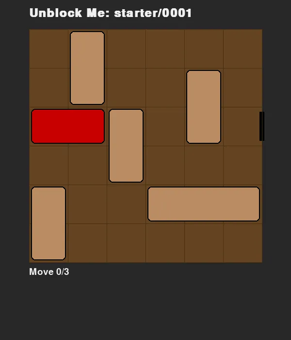
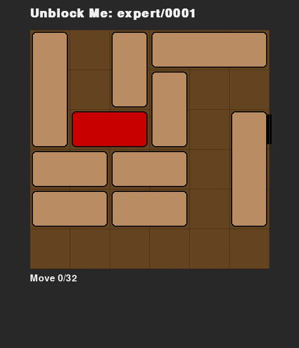

# Unblock Me Solver

An automated solver and graphical interface for the classic **"Unblock Me"** sliding block puzzle.

## About the project

This is a vibe coding project. The project includes a complete engine to model the 6x6 board, an optimized BFS solver to find the absolute shortest paths, and a polished Pygame UI to visualize the solutions with smooth wood-themed animations.

Unblock Me is a simple and addictive puzzle game. The goal is to unblock the red block from the board by sliding the other blocks out of the way.

Below is the solution animation for the first level (`starter/1`) generated by the solver:

And this is the solution animation for the first expert level (`expert/1`) generated by the solver:

## Executables & Commands

### 1. Solver & Visualizer (`solver_ui.py`)
Finds the shortest sequence of moves and launches the graphical interface for playback.
- **Run with manual control:** `python3 unblock-me-solver/solver_ui.py starter/1`
- **Run with Autoplay:** `python3 unblock-me-solver/solver_ui.py starter/1 --autoplay`
- **Controls:**
  - **ENTER:** Toggle Auto-play
  - **SPACE:** Animate Next Step
  - **RIGHT/LEFT:** Jump Next/Prev (Instant)
  - **R:** Reset to start
  - **ESC:** Quit

### 2. Level Editor (`level_editor.py`)
Create or modify puzzle levels using an intuitive drag-and-drop interface.
- **Usage:** `python3 unblock-me-solver/level_editor.py starter/1`
- **Controls:** 
  - **Left Click & Drag:** Create a slider (automatic orientation and length).
  - **Right Click / 'X':** Remove a slider.
  - **'T':** While hovering, set a horizontal slider as the Target (Red block).
  - **'S':** Save and exit.
  - **ESC:** Quit without saving.

### 3. Edit and Solve Script (`edit_and_solve.sh`)
Streamlined workflow to edit a level and immediately see its shortest solution with autoplay.
- **Usage:** `./unblock-me-solver/edit_and_solve.sh starter/1`

### 4. WebP Exporter (`export_webp.py`)
Renders a solution path into an optimized animated WebP file.
- **Usage:** `python3 unblock-me-solver/export_webp.py starter/1`
- **Output:** Saved to `unblock-me-solver/solutions/starter/0001.webp`.

### 5. Batch Exporter (`batch_export.py`)
Automatically exports all missing solutions in parallel.
- **Usage:** `python3 unblock-me-solver/batch_export.py -p 8`
- **Flag:** `-p` sets the level of parallelism (default: 10).

## Core Components

- **`board.py`**: The core engine handling piece movement (multi-tile slides), boundary checks, and collision detection.
- **`board_io.py`**: Handles parsing and serialization of board states to/from ASCII text format.
- **`parsing_util.py`**: Normalizes level identifiers (e.g., `starter/1` -> `levels/starter/0001.txt`).
- **`visualizer.py`**: Rendering module using Pygame with wood-themed aesthetics and distance-aware animation timing.
- **`solver.py`**: BFS search engine that guarantees the shortest path in terms of total slider moves.

## Technical Highlights
- **Optimal BFS**: Uses Breadth-First Search to ensure the solution found uses the minimum number of moves.
- **Multi-tile Sliding**: Correctly models the rule where a block can slide any number of empty spaces as a single move.
- **Heuristic-Guided Search**: Within each depth level, the solver uses a distance-to-exit heuristic to find solutions faster.
- **Smooth Interpolation**: Animations maintain a constant speed (seconds per tile) regardless of slide distance.
- **Wood Aesthetics**: High-quality dark brown and oak color scheme for a classic physical puzzle feel.
- **Headless Export**: Support for off-screen WebP rendering for batch processing.
